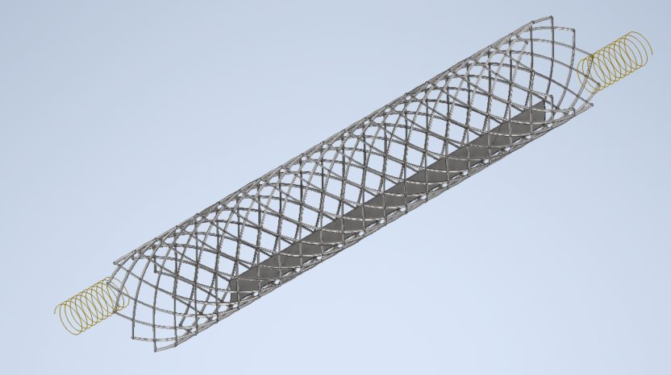

# Estudio de Viabilidad y Diseño Conceptual de un Stent Arterial Inteligente con regulación basada en sensores. 
**Autora:** Julia Arellano Atienza  
**Tutor:** Guirguis Zaki Guirguis Abdelmessih  
**Grado en Ingeniería de la Salud**  
**Universidad de Burgos** 

---

## Introducción

Las enfermedades cardiovasculares representan aproximadamente el 32 % de todas las muertes a nivel mundial, situándose como la principal causa de fallecimiento. Entre las patologías más comunes se encuentra la arterioesclerosis, caracterizada por el estrechamiento de las arterias debido a la acumulación de placas de ateroma, lo que limita el flujo sanguíneo y puede derivar en eventos isquémicos graves, como infarto de miocardio o accidente cerebrovascular.

Para tratar estas obstrucciones, la implantación de stents es una estrategia habitual que permite mantener abierto el vaso sanguíneo afectado y restaurar el flujo sanguíneo. Desde su introducción, los stents han evolucionado incluyendo variantes farmacoactivas y recubiertas con polímeros para reducir complicaciones. Sin embargo, aún presentan limitaciones importantes: entre un 20 % y un 30 % de los pacientes desarrollan reestenosis (re-estrechamiento del vaso) y existe riesgo de trombosis del stent, complicación potencialmente mortal. Además, los stents actuales carecen de mecanismos de monitorización en tiempo real, dificultando la detección precoz de estas complicaciones.

Frente a esta necesidad, surgen los stents inteligentes con sensores integrados, capaces de monitorizar parámetros fisiológicos como presión, flujo o rigidez arterial, proporcionando datos continuos para la evaluación clínica y la personalización del tratamiento.

---
## Objetivo General

El presente proyecto tiene como objetivo el diseño conceptual de un stent inteligente con sensores integrados, orientado a mejorar la detección precoz de complicaciones como la reestenosis y la trombosis, así como a facilitar un seguimiento más efectivo y personalizado de los pacientes tras la intervención.

El proyecto incluye el diseño y evaluación del prototipo conceptual mediante análisis bibliográfico y modelado matemático, buscando su viabilidad funcional y su posible aplicación clínica futura.

---
## Resultados

A continuación se muestra el diseño 3D del stent inteligente desarrollado:

  
*Figura 1. Vista del stent inteligente.*

También se ha implementado una aplicación interactiva que permite visualizar el stent, simular su comportamiento ante distintas condiciones y analizar los parámetros del sistema:

🔗 [Haz clic aquí para acceder a la aplicación](https://tfg-gis-stent-inteligente.streamlit.app/)

  
*Figura 2. QR de la aplicación.*